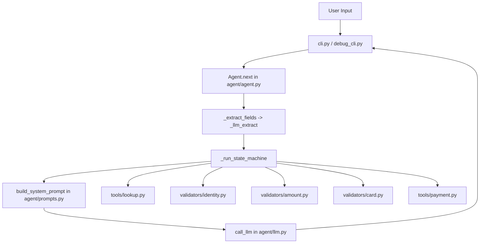
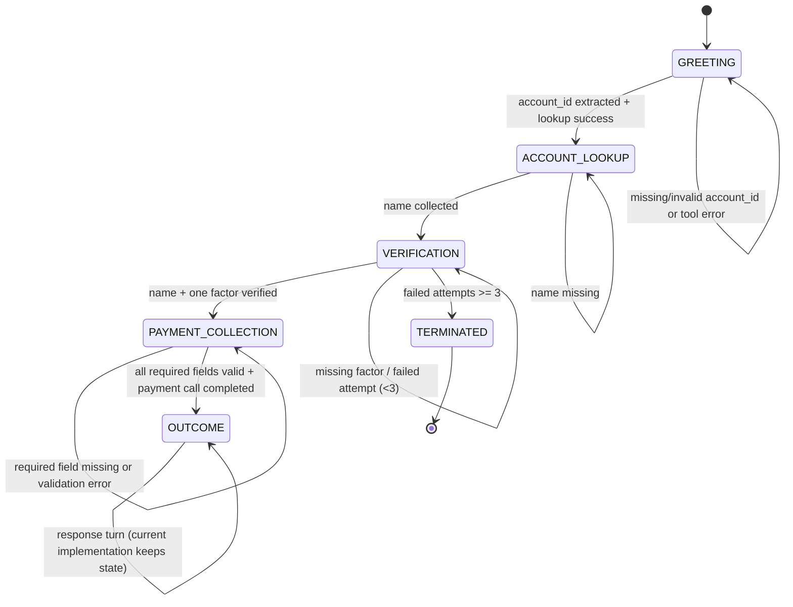

# Payment Collection Agent - Interactive Workflow

Use this file as a live walkthrough while running `debug_cli.py`.

---

## Quick Navigation

- [Architecture at a Glance](#architecture-at-a-glance)
- [One Turn Lifecycle](#one-turn-lifecycle)
- [State Machine](#state-machine)
- [State-by-State Deep Dive](#state-by-state-deep-dive)
- [LLM vs Backend Responsibilities](#llm-vs-backend-responsibilities)
- [Why Chats Get Stuck in PAYMENT_COLLECTION](#why-chats-get-stuck-in-payment_collection)
- [Debug Along with Logs](#debug-along-with-logs)

---

## Architecture at a Glance



---

## One Turn Lifecycle

For every user message, `Agent.next(user_input)` runs this sequence:

1. **Termination guard**
   - If state is `TERMINATED`, return fixed end message.
2. **Conversation update**
   - Append user message to `ctx.conversation`.
3. **Field extraction (LLM only)**
   - Extract only fields allowed for current state (`STATE_FIELDS`).
   - Merge non-null fields into `ctx.collected`.
4. **State machine execution**
   - Deterministic backend transitions/validation/tool calls.
5. **Prompt creation**
   - Build prompt from current state + context.
6. **Response generation**
   - Call LLM to generate conversational reply.
7. **Conversation update**
   - Append assistant reply and return to CLI.

---

## State Machine



---

## State-by-State Deep Dive

### 1) `GREETING`
- **Expected field:** `account_id`
- **Backend action:** `lookup_account(account_id)`
- **On success:** store `ctx.account`, transition to `ACCOUNT_LOOKUP`
- **On failure:** set `ctx.last_error`, clear bad account id when needed

### 2) `ACCOUNT_LOOKUP`
- **Expected field:** `name`
- **On success:** transition to `VERIFICATION`
- **If missing:** remain here and ask for full name

### 3) `VERIFICATION`
- **Expected fields:** one of `dob` / `aadhaar` / `pincode` (name already needed)
- **Backend action:** `verify_identity(...)`
- **On success:** set `verified=True`, move to `PAYMENT_COLLECTION`, clear verification fields
- **On failure:** increment `retry_count`, set `last_error`, clear verification fields
- **After 3 failures:** transition to `TERMINATED`

### 4) `PAYMENT_COLLECTION`
- **Required fields:**
  - `amount`
  - `card_number`
  - `cvv`
  - `expiry_month`
  - `expiry_year`
  - `cardholder_name`
- **Validation sequence:**
  - `validate_amount(...)`
  - `luhn_check(...)`
  - `validate_cvv(...)`
  - `validate_expiry(...)`
- **If any field missing:** stay in `PAYMENT_COLLECTION`
- **If validation fails:** set `last_error`, clear only failed fields, stay in state
- **If valid:** call `process_payment(...)`, save `payment_result`, move to `OUTCOME`

### 5) `OUTCOME`
- LLM communicates success/failure using context.
- Current code keeps state at `OUTCOME` in `_run_state_machine`.

### 6) `TERMINATED`
- Any further turn returns: conversation ended.

---

## LLM vs Backend Responsibilities

### LLM does
- Extract structured data from free text (`_llm_extract`)
- Write natural language responses

### Backend/Python does
- State transitions and business logic
- Account lookup + payment API calls
- Identity and payment validations
- Retry and termination rules

---

## Why Chats Get Stuck in `PAYMENT_COLLECTION`

Typical case:
- Card details are extracted
- `amount` is `null` or missing
- Required-fields gate blocks payment call
- State remains `PAYMENT_COLLECTION`

This is expected by design until `amount` is collected.

---

## Debug Along with Logs

Run:

```powershell
venv\Scripts\python debug_cli.py
```

Optional breakpoints:

```powershell
$env:DEBUG_BREAKPOINTS="1"
venv\Scripts\python debug_cli.py
```

What to monitor in trace:
- `LLM CALL START [EXTRACTION]` -> extracted JSON should include required fields
- `SNAPSHOT (AFTER agent.next)` -> inspect `state`, `collected`, `last_error`
- If state is `PAYMENT_COLLECTION`, verify `amount` exists in `collected`

---

## Field Matrix by State

| State | Fields extracted this turn |
|---|---|
| `GREETING` | `account_id` |
| `ACCOUNT_LOOKUP` | `name` |
| `VERIFICATION` | `dob`, `aadhaar`, `pincode` |
| `PAYMENT_COLLECTION` | `amount`, `card_number`, `cvv`, `expiry_month`, `expiry_year`, `cardholder_name` |
| `OUTCOME` | none |
| `TERMINATED` | none |

---

## Practical Test Script (Manual)

1. Enter: `ACC1001`
2. Enter full name: `Nithin Jain`
3. Enter one factor: `1990-05-14`
4. Enter card block **without amount**  
   - Expect: state remains `PAYMENT_COLLECTION`, assistant asks for amount.
5. Enter amount: `500`
6. Expect payment processing and move to `OUTCOME`.

